<div align="center">

```
  ██████╗ ██████╗  ██████╗ ███╗   ██╗███████╗██╗  ██╗
 ██╔════╝██╔═══██╗██╔════╝ ████╗  ██║██╔════╝╚██╗██╔╝
 ██║     ██║   ██║██║  ███╗██╔██╗ ██║█████╗   ╚███╔╝
 ██║     ██║   ██║██║   ██║██║╚██╗██║██╔══╝   ██╔██╗
 ╚██████╗╚██████╔╝╚██████╔╝██║ ╚████║███████╗██╔╝ ██╗
  ╚═════╝ ╚═════╝  ╚═════╝ ╚═╝  ╚═══╝╚══════╝╚═╝  ╚═╝
```

### Knowledge, unchained from the cloud.

**COGNEX** is a fully offline factual answering engine that delivers precise, structured answers to natural language queries — without any internet connection or external APIs.

[](https://python.org)
[](https://fastapi.tiangolo.com)
[](LICENSE)
[]()
[]()

</div>

---

## Screenshots

### Hero Landing
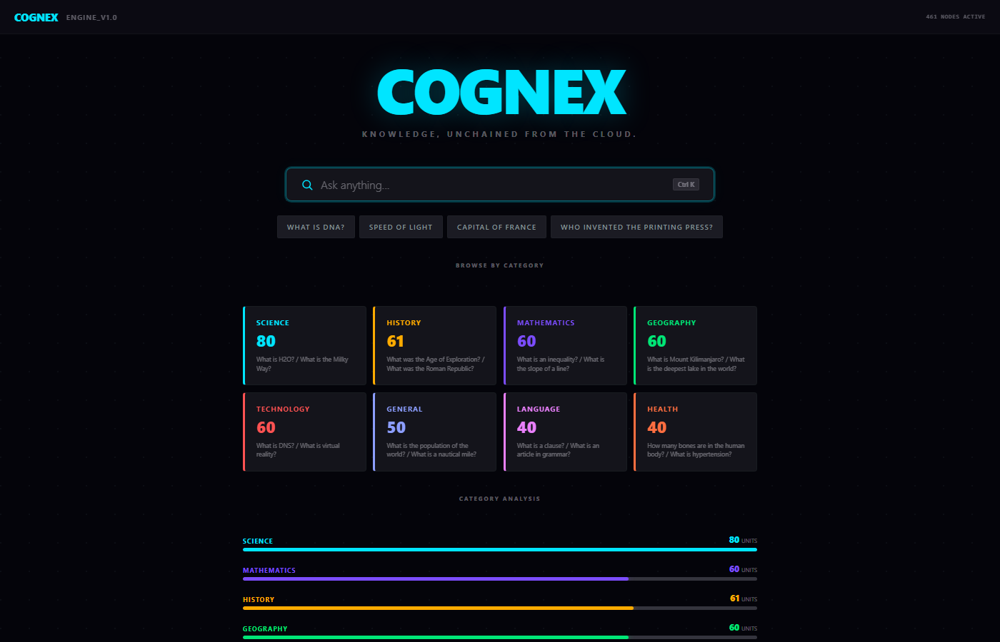

### Search Results — Intelligence View
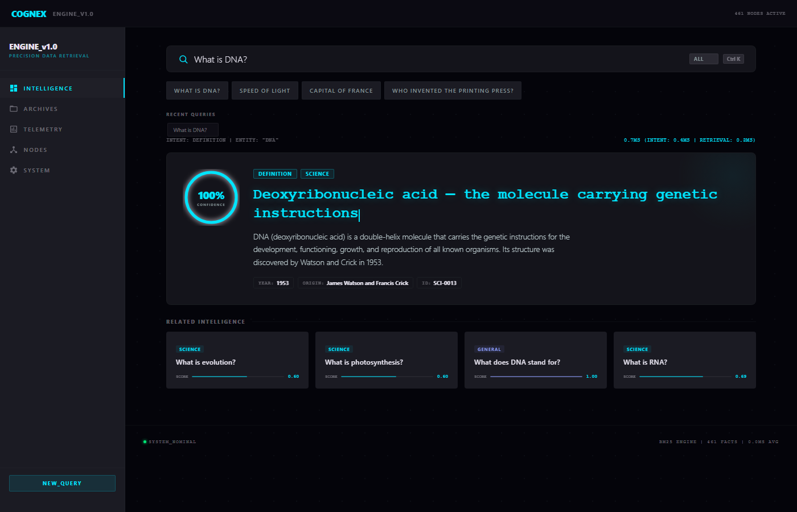

### Dashboard
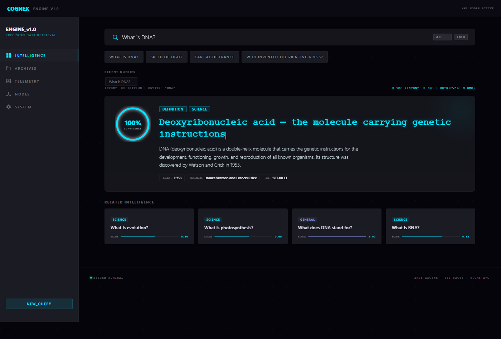

### Browse by Category
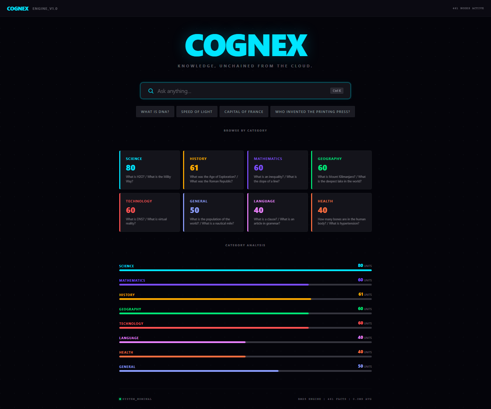

### No Results State
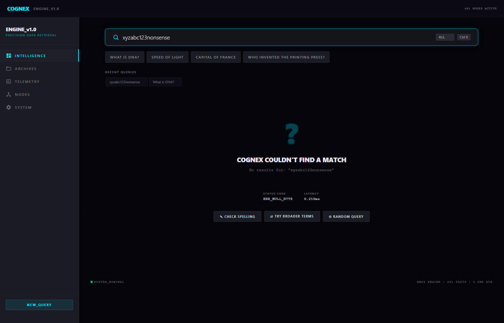

### Archives View
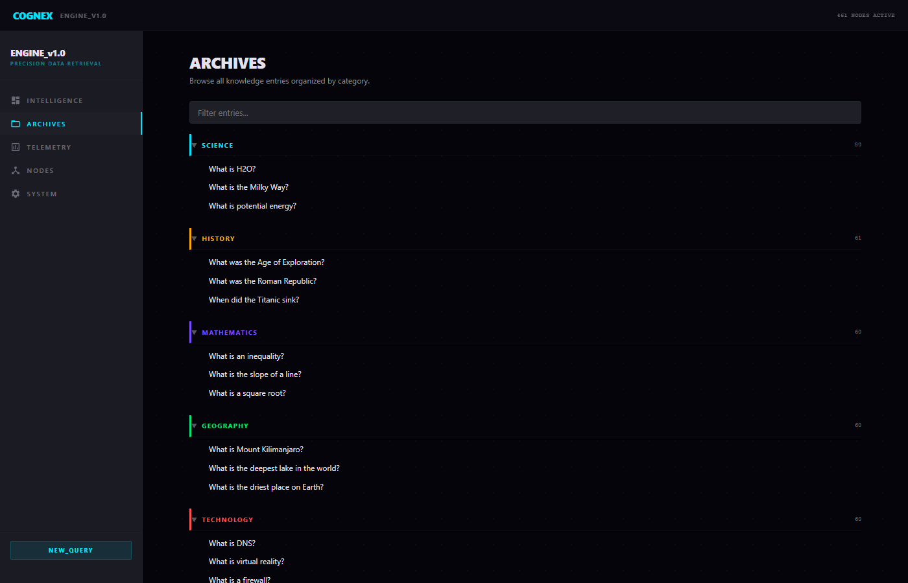

### Telemetry View
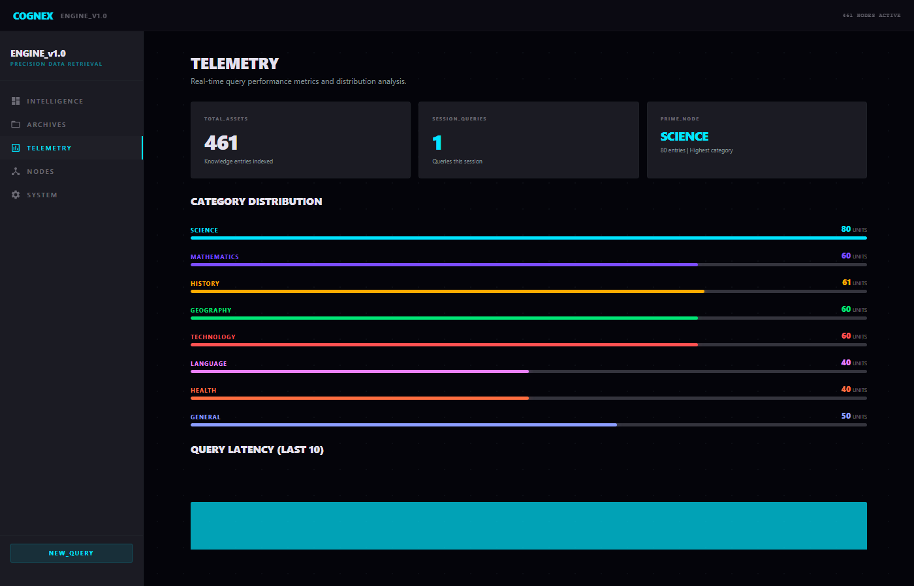

### Nodes View
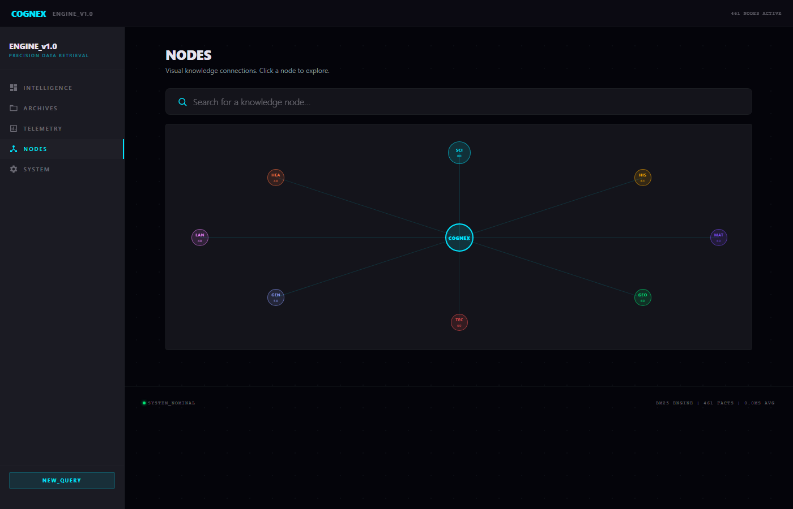

### System View
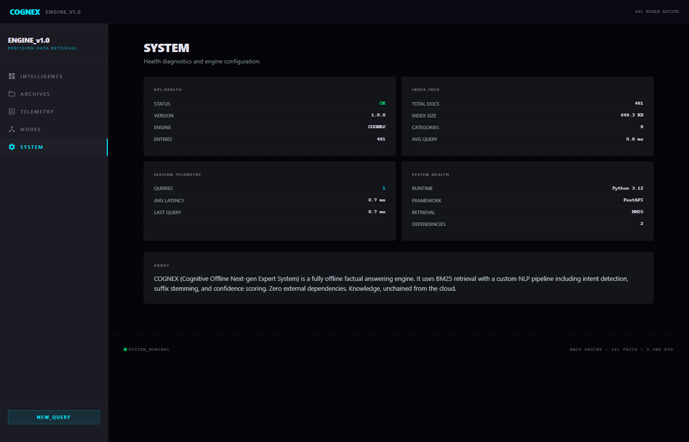

---

## Features

- **Offline-First** — Zero API calls, zero internet required. Everything runs locally.
- **BM25 Retrieval** — Industry-standard ranking algorithm with field-weighted scoring
- **Intent Classification** — 7 intent types (Definition, Formula, Date, Person, Place, Comparison, Factual)
- **461 Curated Facts** — Across 8 categories: Science, Mathematics, History, Geography, Technology, Language, Health, General
- **Sub-millisecond Retrieval** — Pre-built inverted index with alias fast-path
- **Command Center UI** — Stitch-designed dashboard with 5 views
- **Confidence Scoring** — Visual confidence arc with color-coded reliability indicators
- **Docker Ready** — Multi-stage build, runs anywhere

## Architecture

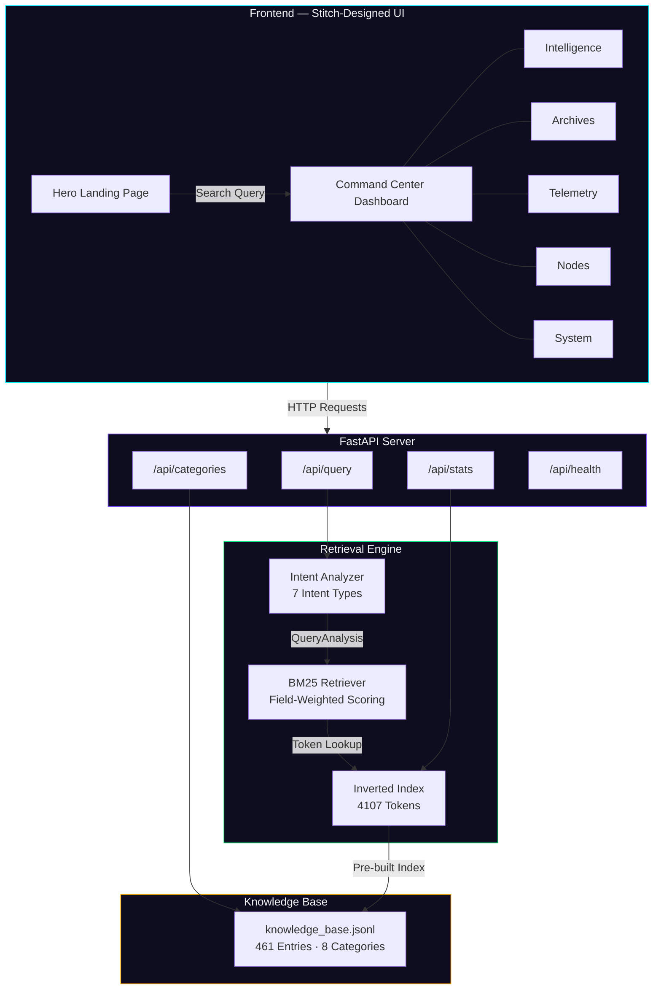

## Query Flow

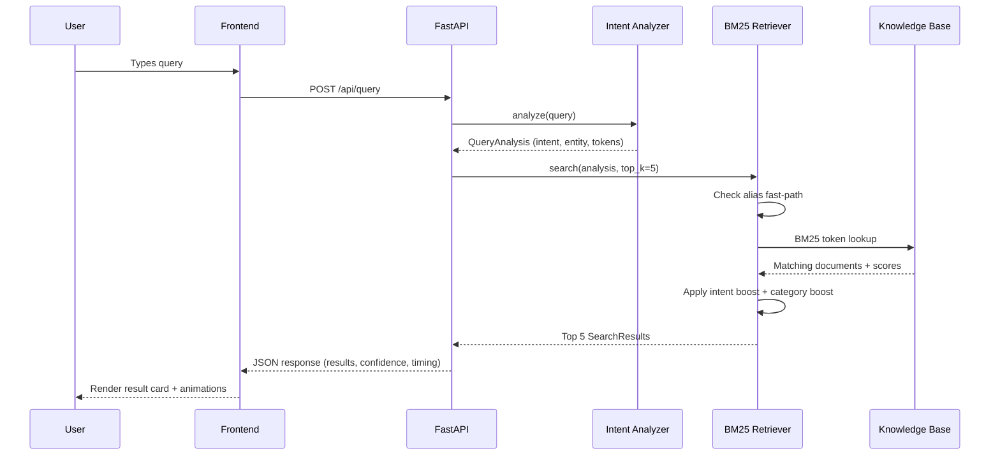

## Quick Start

### Local

```bash
pip install fastapi uvicorn[standard]
python -c "from indexer import CognexIndexer; CognexIndexer().build_and_save('knowledge_base.jsonl', 'cognex_index.pkl')"
uvicorn main:app --host 0.0.0.0 --port 8000
```

Open http://localhost:8000

### Docker

```bash
docker build -t cognex .
docker run -p 8000:8000 cognex
```

## Dashboard Views

| View | Description |
|--------------|-------------------------------------------------------------------|
| Intelligence | Main search interface with confidence scoring and related results |
| Archives | Browse all 461 entries organized by category |
| Telemetry | Real-time query performance metrics and analytics |
| Nodes | Knowledge graph visualization of entry connections |
| System | Health monitoring, index info, and system configuration |

## Tech Stack

| Component | Technology |
|----------------|------------------------------------------------------|
| Backend | Python 3.12, FastAPI, Uvicorn |
| Retrieval | Custom BM25 engine (stdlib only) |
| NLP | Rule-based intent classifier with suffix stemmer |
| Knowledge Base | JSONL (461 curated entries) |
| Frontend | Vanilla HTML/CSS/JS, Google Stitch design |
| Container | Docker (multi-stage build) |

## API Endpoints

| Method | Endpoint | Description |
|--------|-----------------|----------------------------|
| POST | /api/query | Submit a factual query |
| GET | /api/stats | Knowledge base statistics |
| GET | /api/categories | Category list with counts |
| GET | /api/health | System health check |

## Performance

| Metric | Value |
|--------------------|--------------------------|
| Average Query Time | <1ms |
| Intent Accuracy | 100% (55/55 tests) |
| Top-3 Hit Rate | 100% |
| Index Build Time | <1s |
| Knowledge Base | 461 entries, 4107 tokens |

## Project Structure

```
cognex/
├── main.py              # FastAPI server + API routes
├── indexer.py           # BM25 inverted index builder
├── retriever.py         # Search engine with alias fast-path
├── intent.py            # NLP intent classifier + stemmer
├── knowledge_base.jsonl # 461 curated factual entries
├── test_cognex.py       # 55 validation tests
├── static/
│   ├── index.html       # Stitch-designed command center UI
│   └── favicon.svg      # COGNEX hexagonal logo
├── screenshots/         # Application screenshots
├── Dockerfile           # Multi-stage Docker build
├── docker-compose.yml   # One-command deployment
├── requirements.txt     # fastapi + uvicorn only
├── glitch.json          # Glitch deployment config
└── README.md
```

## License

MIT License — see [LICENSE](LICENSE) for details.
